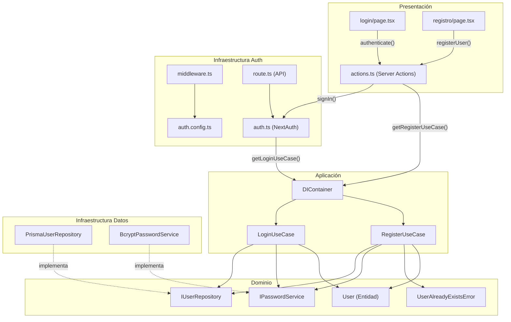

# Análisis del Sistema de Autenticación (Login, Logout, Registro)

## Resumen General

El sistema de autenticación está construido sobre **NextAuth.js v5** con un proveedor de credenciales (email + contraseña). La arquitectura sigue principios de **Clean Architecture** con separación en capas: dominio, aplicación, infraestructura y presentación. Se utiliza un **contenedor de inyección de dependencias** para desacoplar las implementaciones concretas.

---

## Archivos Analizados (14 en total)

| Capa | Archivo | Descripción |
|------|---------|-------------|
| **UI** | [login/page.tsx](file:///c:/Users/Telfy/Documents/MaterialesMasterIA/TFM/sendanipona/src/app/login/page.tsx) | Página de inicio de sesión |
| **UI** | [registro/page.tsx](file:///c:/Users/Telfy/Documents/MaterialesMasterIA/TFM/sendanipona/src/app/registro/page.tsx) | Página de registro |
| **Server Actions** | [actions.ts](file:///c:/Users/Telfy/Documents/MaterialesMasterIA/TFM/sendanipona/src/app/lib/actions.ts) | Actions de login, logout y registro |
| **API** | [route.ts](file:///c:/Users/Telfy/Documents/MaterialesMasterIA/TFM/sendanipona/src/app/api/auth/%5B...nextauth%5D/route.ts) | Ruta de NextAuth |
| **Auth** | [auth.ts](file:///c:/Users/Telfy/Documents/MaterialesMasterIA/TFM/sendanipona/src/infrastructure/auth/auth.ts) | Configuración de NextAuth con Credentials |
| **Auth** | [auth.config.ts](file:///c:/Users/Telfy/Documents/MaterialesMasterIA/TFM/sendanipona/src/infrastructure/auth/auth.config.ts) | Config de callbacks y páginas |
| **Middleware** | [middleware.ts](file:///c:/Users/Telfy/Documents/MaterialesMasterIA/TFM/sendanipona/src/middleware.ts) | Middleware de protección de rutas |
| **DI** | [container.ts](file:///c:/Users/Telfy/Documents/MaterialesMasterIA/TFM/sendanipona/src/infrastructure/di/container.ts) | Contenedor de inyección de dependencias |
| **Use Cases** | [LoginUseCase.ts](file:///c:/Users/Telfy/Documents/MaterialesMasterIA/TFM/sendanipona/src/core/application/use-cases/auth/LoginUseCase.ts) | Caso de uso de login |
| **Use Cases** | [RegisterUseCase.ts](file:///c:/Users/Telfy/Documents/MaterialesMasterIA/TFM/sendanipona/src/core/application/use-cases/auth/RegisterUseCase.ts) | Caso de uso de registro |
| **Domain** | [User.ts](file:///c:/Users/Telfy/Documents/MaterialesMasterIA/TFM/sendanipona/src/core/domain/entities/User.ts) | Entidad de dominio de usuario |
| **Domain** | [IUserRepository.ts](file:///c:/Users/Telfy/Documents/MaterialesMasterIA/TFM/sendanipona/src/core/domain/repositories/IUserRepository.ts) | Interface del repositorio |
| **Domain** | [IPasswordService.ts](file:///c:/Users/Telfy/Documents/MaterialesMasterIA/TFM/sendanipona/src/core/domain/services/IPasswordService.ts) | Interface del servicio de contraseñas |
| **Domain** | [UserAlreadyExistsError.ts](file:///c:/Users/Telfy/Documents/MaterialesMasterIA/TFM/sendanipona/src/core/domain/errors/UserAlreadyExistsError.ts) | Error de dominio |
| **Infra** | [PrismaUserRepository.ts](file:///c:/Users/Telfy/Documents/MaterialesMasterIA/TFM/sendanipona/src/infrastructure/repositories/PrismaUserRepository.ts) | Implementación Prisma del repositorio |
| **Infra** | [BcryptPasswordService.ts](file:///c:/Users/Telfy/Documents/MaterialesMasterIA/TFM/sendanipona/src/infrastructure/services/BcryptPasswordService.ts) | Implementación Bcrypt del servicio |

---

## ✅ Lo Que Está Bien Hecho

### 1. Arquitectura Limpia bien aplicada
- Clara separación en capas: **dominio** → **aplicación** → **infraestructura** → **presentación**
- Las interfaces (`IUserRepository`, `IPasswordService`) están en el dominio, las implementaciones en infraestructura
- Los use cases no dependen de ningún framework concreto

### 2. Contenedor de Inyección de Dependencias
- `container.ts` centraliza la creación de instancias
- Facilita cambiar Prisma por otro ORM o Bcrypt por Argon2 sin tocar la lógica de negocio

### 3. Validación con Zod
- Tanto `LoginUseCase` como `RegisterUseCase` usan esquemas Zod para validar DTOs
- El registro valida que las contraseñas coincidan con `.refine()`

### 4. Errores de dominio explícitos
- `UserAlreadyExistsError` es un error de dominio limpio que extiende `Error`

### 5. Uso de Server Actions
- `actions.ts` utiliza el patrón `'use server'` de Next.js correctamente
- El redirect está fuera del `try-catch` para evitar problemas conocidos de Next.js

### 6. Registro: buena UX
- Formulario con diseño premium (glassmorphismo, gradientes, spinner animado)
- Link de navegación entre login y registro
- Mensajes de error estilizados

---

## ⚠️ Problemas y Mejoras Necesarias

### ✅ Resueltos

#### ~~1. Login: diseño inconsistente con el Registro~~ → RESUELTO
Rediseñado con tema oscuro premium: glassmorfismo, inputs coherentes, gradiente naranja, spinner y enlace a registro.

#### ~~2. Login automático tras registro~~ → RESUELTO
Tras registrarse, se llama a `signIn('credentials')` automáticamente y se redirige a `/`.

#### ~~3. Validación duplicada en `auth.ts`~~ → RESUELTO
Eliminada la validación Zod de `auth.ts`. Solo valida `LoginUseCase`.

#### ~~4. `aria-disabled` vs `disabled`~~ → RESUELTO
Añadido `disabled={pending}` al `LoginButton`.

#### ~~5. Middleware: lógica redundante~~ → RESUELTO
Simplificado con un array `PROTECTED_ROUTES` extensible (`/dashboard`, `/perfil`, `/favoritos`).

#### ~~6. Protección contra usuarios desactivados~~ → RESUELTO
Añadida verificación `if (!user.isActive) return null;` en `LoginUseCase`.

### 🟡 Severidad Media (pendientes)

#### 7. Falta gestión de sesiones/callbacks en NextAuth
No hay callbacks de `session` ni `jwt` configurados en `auth.ts`. Esto significa que datos extra del usuario (como `id` o `username`) **NO estarán disponibles** en la sesión del cliente. Solo se tendrá `name`, `email` e `image` por defecto.

#### 8. No hay rate limiting
No existe protección contra ataques de **fuerza bruta** en el login ni en el registro.

#### 9. Falta un enlace "¿Olvidaste tu contraseña?"
El formulario de login no ofrece opción de recuperación de contraseña.

### 🟢 Severidad Baja

#### 10. `useFormState` está deprecado (React 19)
Tanto el login como el registro usan `useFormState` de `'react-dom'`. Aunque React 19 lo renombra a `useActionState`, **en React 18 (versión actual del proyecto) `useFormState` es el hook correcto**. No se puede migrar hasta actualizar a React 19.

#### 11. Comentarios en `IPasswordService` en inglés
Las demás interfaces y entidades tienen documentación en español, pero `IPasswordService` está documentada en inglés. Inconsistencia menor.

#### 12. `PrismaUserRepository.save()`: password fallback
En la línea de `create`, hay un fallback `password: user.password || ''` que podría crear usuarios con password vacío si se usara mal.

#### 13. Falta un enlace de "Crear cuenta" en la página de login
El registro tiene un enlace a login, pero **el login no tiene un enlace al registro**.

---

## 🚧 Lo Que Falta por Hacer

| Prioridad | Tarea | Estado |
|-----------|-------|--------|
| ~~🔴 Alta~~ | ~~Homogeneizar diseño del login~~ | ✅ Resuelto |
| ~~🔴 Alta~~ | ~~Login automático tras registro~~ | ✅ Resuelto |
| 🔴 Alta | **Callbacks JWT/Session** | ⬜ Pendiente |
| ~~🟡 Media~~ | ~~Verificar `isActive`~~ | ✅ Resuelto |
| ~~🟡 Media~~ | ~~Eliminar validación duplicada~~ | ✅ Resuelto |
| ~~🟡 Media~~ | ~~Fix `disabled` en LoginButton~~ | ✅ Resuelto |
| ~~🟡 Media~~ | ~~Enlace a registro desde login~~ | ✅ Resuelto |
| ~~🟡 Media~~ | ~~Middleware redundante~~ | ✅ Resuelto |
| ~~🟡 Media~~ | ~~Logout: botón en la UI~~ | ✅ Resuelto (en Header) |
| 🟢 Baja | **Migrar a `useActionState`** | ⏳ Pospuesto (React 19) |
| 🟢 Baja | **Recuperar contraseña** | ⬜ Pendiente |
| 🟢 Baja | **Rate limiting** | ⬜ Pendiente |
| 🟢 Baja | **Comentarios consistentes** | ⬜ Pendiente |

---

## Diagrama de Arquitectura Actual

