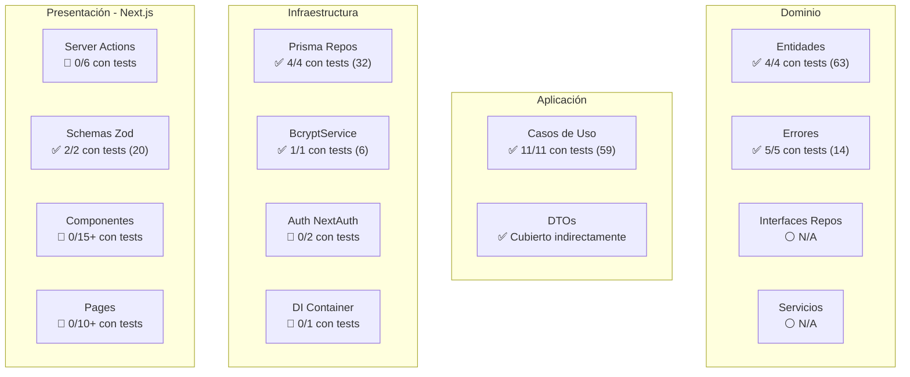

# 🔍 Auditoría Completa de Testing — Senda Nipona

Análisis exhaustivo del estado de testing del repositorio **sendanipona** (Next.js 14 + Clean Architecture + Vitest).

---

## 1. Mapeo de Cobertura por Capas

### Estado Actual de Tests

| Capa | Archivos de Código | Tests Existentes | Cobertura |
|---|---|---|---|
| **Dominio — Entidades** | 4 (User, Comment, Article, ArticleTopic) | 4 archivos (63 tests) | ✅ 100% |
| **Dominio — Errores** | 5 errores específicos | 1 archivo (14 tests) | ✅ 100% |
| **Dominio — Interfaces (Repos)** | 4 interfaces | N/A (no requieren tests directos) | ⚪ N/A |
| **Dominio — Servicios** | 1 (IPasswordService) | N/A (interfaz) | ⚪ N/A |
| **Aplicación — Casos de Uso** | 11 casos de uso | 11 archivos (59 tests) | ✅ 100% |
| **Aplicación — DTOs** | 1 (CommentDTO) | Cubierto indirectamente por CreateCommentUseCase.test.ts | ✅ Indirecto |
| **Infraestructura — Repositorios** | 4 Prisma repos | 4 archivos (32 tests) | ✅ 100% |
| **Infraestructura — Servicios** | 1 (BcryptPasswordService) | 1 archivo (6 tests) | ✅ 100% |
| **Infraestructura — Auth** | 2 (auth.ts, auth.config.ts) | 0 | 🔴 0% |
| **Infraestructura — DI** | 1 (container.ts) | 0 | 🔴 0% |
| **App — Server Actions** | 1 (actions.ts con 6 funciones) | 0 | 🔴 0% |
| **App — Schemas (Zod)** | 1 (schemas.ts) | 2 archivos (20 tests) | ✅ 100% |
| **App — Componentes React** | ~15+ componentes | 0 | 🔴 0% |
| **App — Pages** | ~10+ páginas | 0 | 🔴 0% |

### Resumen Cuantitativo

- **Total de archivos de código testeable**: ~45+
- **Total de archivos con tests**: 23
- **Total de tests**: 195
- **Cobertura estimada global**: **~60%** (dominio 100%, aplicación 100%, infraestructura 60%)

---

## 2. Detección de Brechas — Estado Actual

### ~~🔴 Prioridad CRÍTICA — Lógica de Negocio Sin Tests~~ ✅ RESUELTO

> [!NOTE]
> Todos los 11 casos de uso tienen tests unitarios completos con mocks de repositorios.

| Caso de Uso | Estado | Tests |
|---|---|---|
| RegisterUseCase | ✅ Cubierto | 6 tests — registro exitoso, usuario duplicado, hashing, creación de entidad |
| LoginUseCase | ✅ Cubierto | 7 tests — login exitoso, usuario no existe, contraseña incorrecta, cuenta inactiva |
| CreateCommentUseCase | ✅ Cubierto | 5 tests — creación exitosa, comentario duplicado (CommentAlreadyExistsError) |
| DeleteCommentUseCase | ✅ Cubierto | 6 tests — eliminación exitosa, comentario no existe, usuario no propietario |
| CheckUserCommentUseCase | ✅ Cubierto | 3 tests — retorna true/false según existencia |
| GetArticleCommentsUseCase | ✅ Cubierto | 7 tests — paginación (offset), pageSize por defecto y personalizado |
| GetArticleBySlug | ✅ Cubierto | 5 tests — artículo encontrado, null, slug vacío |
| GetNavigationData | ✅ Cubierto | 5 tests — transformación entidades → DTOs serializables |
| GetArticleById | ✅ Cubierto | 6 tests — artículo encontrado, null, ID vacío/espacios |
| GetArticlesByTopic | ✅ Cubierto | 6 tests — artículos del topic, array vacío, topicId ≤ 0 |
| GetAllArticles | ✅ Cubierto | 4 tests — retorna todos, array vacío, delegación, instancias |

### ~~🟡 Prioridad ALTA — Entidad sin Test~~ ✅ RESUELTO

| Archivo | Estado |
|---|---|
| ArticleTopic.ts | ✅ Test creado: ArticleTopic.test.ts (10 tests) |

### ~~🟡 Prioridad ALTA — Schemas Zod sin Test~~ ✅ RESUELTO

| Archivo | Estado |
|---|---|
| schemas.ts — RegisterSchema | ✅ RegisterSchema.test.ts (12 tests) — email, nombre, password, confirmPassword, refine |
| schemas.ts — LoginSchema | ✅ LoginSchema.test.ts (8 tests) — email, password, mensajes de error verificados |

### ~~🟠 Prioridad MEDIA — BcryptPasswordService~~ ✅ RESUELTO

| Archivo | Estado |
|---|---|
| BcryptPasswordService.ts | ✅ BcryptPasswordService.test.ts (6 tests) — hash, compare round-trip, salt aleatorio |

### ~~🟠 Prioridad MEDIA — Repositorios Prisma~~ ✅ RESUELTO

| Archivo | Estado |
|---|---|
| PrismaUserRepository.ts | ✅ PrismaUserRepository.test.ts (7 tests) — save (create/update), findByEmail, findById |
| PrismaArticleTopicRepository.ts | ✅ PrismaArticleTopicRepository.test.ts (6 tests) — findAll, findById, findAllWithArticles |
| PrismaArticleRepository.ts | ✅ PrismaArticleRepository.test.ts (8 tests) — findAll, findBySlug, findById, findByTopicId |
| PrismaCommentRepository.ts | ✅ PrismaCommentRepository.test.ts (11 tests) — create, findByArticleId (paginación), findByUserAndArticle, findById, delete |

> [!NOTE]
> Tests de integración con SQLite temporal. Cada suite crea su propia base de datos en disco (`test-*.db`) que se elimina después de los tests.

### 🟠 Prioridad MEDIA — Infraestructura Pendiente

| Archivo | Brecha |
|---|---|
| Auth NextAuth (2 archivos) | Sin tests de configuración de autenticación |
| DI Container (1 archivo) | Sin tests de resolución de dependencias |

### 🔵 Prioridad BAJA — Sin Tests E2E/Integración

- **Flujo de registro**: No hay test E2E del formulario → server action → DB
- **Flujo de login**: No hay test E2E del formulario → NextAuth → sesión
- **Flujo de comentarios**: No hay test E2E de crear/eliminar comentarios
- **Navegación de artículos**: No hay test de que las rutas de artículos resuelven correctamente

---

## 3. Evaluación de Calidad de los Tests Existentes

### ✅ Aspectos Positivos

| Criterio | Evaluación |
|---|---|
| **Patrón AAA** | ✅ Todos los tests siguen correctamente Arrange → Act → Assert con comentarios explícitos |
| **Nomenclatura** | ✅ Nombres descriptivos en español (`debe crear un usuario con todos los datos válidos`) |
| **Agrupación** | ✅ Uso correcto de `describe` anidados para agrupar por tema |
| **Casos borde** | ✅ Cubren: strings vacíos, solo espacios, valores límite (10 y 500 chars), valores negativos |
| **Independencia** | ✅ Cada test es independiente, sin estado compartido mutable |
| **Framework** | ✅ Uso correcto de Vitest con `expect`, `toThrow`, `toBe`, `toEqual` |
| **Mocks/Spies** | ✅ Uso correcto de `vi.fn()` y `vi.mocked()` en todos los tests de use cases |
| **Tests parametrizados** | ✅ Uso de `it.each` para emails inválidos, entidades y topics (mejor reporteo individual) |
| **Mensajes de error** | ✅ Todos los tests de schemas verifican los mensajes Zod personalizados exactos |

### ✅ Aspectos Resueltos (anteriormente pendientes)

| Criterio | Estado |
|---|---|
| ~~Mocks/Spies no utilizados~~ | ✅ Resuelto: todos los use cases usan mocks de repositorios con `vi.fn()` |
| ~~Cobertura de `password`~~ | ✅ Resuelto: tests de `password` opcional en User.test.ts |
| ~~Test de ArticleTopic~~ | ✅ Resuelto: ArticleTopic.test.ts con 10 tests |
| ~~Tests parametrizados con forEach~~ | ✅ Resuelto: migrados a `it.each` en User.test.ts, ArticleTopic.test.ts y DomainErrors.test.ts |

---

## 4. Plan de Acción Priorizado

Los tests están clasificados por **impacto** (qué tan crítico es para el negocio) y **dificultad** (esfuerzo de implementación).

### ~~Fase 1 — Impacto ALTO / Dificultad BAJA~~ ✅ COMPLETADA

> Tests unitarios de lógica pura con mocks simples.

| # | Test | Ubicación | Tests | Estado |
|---|---|---|---|---|
| 1 | `RegisterUseCase.test.ts` | `__tests__/unit/use-cases/auth/` | 6 | ✅ Completado |
| 2 | `LoginUseCase.test.ts` | `__tests__/unit/use-cases/auth/` | 7 | ✅ Completado |
| 3 | `CreateCommentUseCase.test.ts` | `__tests__/unit/use-cases/comments/` | 5 | ✅ Completado |
| 4 | `DeleteCommentUseCase.test.ts` | `__tests__/unit/use-cases/comments/` | 6 | ✅ Completado |
| 5 | `ArticleTopic.test.ts` | `__tests__/unit/entities/` | 10 | ✅ Completado |

### ~~Fase 2 — Impacto ALTO / Dificultad MEDIA~~ ✅ COMPLETADA

> Tests unitarios con algo más de configuración pero que cubren lógica importante.

| # | Test | Ubicación | Tests | Estado |
|---|---|---|---|---|
| 6 | `CheckUserCommentUseCase.test.ts` | `__tests__/unit/use-cases/comments/` | 3 | ✅ Completado |
| 7 | `GetArticleCommentsUseCase.test.ts` | `__tests__/unit/use-cases/comments/` | 7 | ✅ Completado |
| 8 | `GetArticleBySlug.test.ts` | `__tests__/unit/use-cases/articles/` | 5 | ✅ Completado |
| 9 | `GetNavigationData.test.ts` | `__tests__/unit/use-cases/articles/` | 5 | ✅ Completado |
| 10 | `RegisterSchema.test.ts` | `__tests__/unit/schemas/` | 12 | ✅ Completado |
| 11 | `LoginSchema.test.ts` | `__tests__/unit/schemas/` | 8 | ✅ Completado |

### ~~Fase 3 — Impacto MEDIO / Dificultad MEDIA~~ ✅ COMPLETADA

> Tests de integración que requieren setup adicional.

| # | Test | Ubicación | Tests | Estado |
|---|---|---|---|---|
| 12 | `BcryptPasswordService.test.ts` | `__tests__/integration/services/` | 6 | ✅ Completado |
| 13 | `DomainErrors.test.ts` | `__tests__/unit/errors/` | 14 | ✅ Completado |

### ~~Fase 4 — Impacto MEDIO / Dificultad ALTA~~ ✅ COMPLETADA (Repositorios Prisma)

> Tests de integración con base de datos SQLite temporal.

| # | Test | Ubicación | Tests | Estado |
|---|---|---|---|---|
| 14 | `PrismaUserRepository.test.ts` | `__tests__/integration/repositories/` | 7 | ✅ Completado |
| 15 | `PrismaArticleTopicRepository.test.ts` | `__tests__/integration/repositories/` | 6 | ✅ Completado |
| 16 | `PrismaArticleRepository.test.ts` | `__tests__/integration/repositories/` | 8 | ✅ Completado |
| 17 | `PrismaCommentRepository.test.ts` | `__tests__/integration/repositories/` | 11 | ✅ Completado |

### Fase 5 — Impacto MEDIO / Dificultad ALTA ⏳ PENDIENTE

> Tests de infraestructura avanzada y E2E.

| # | Test a Crear | Ubicación Propuesta | Qué Testear | Estado |
|---|---|---|---|---|
| 18 | Tests de Auth NextAuth | `__tests__/integration/auth/` | Configuración, callbacks, providers | ⏳ Pendiente |
| 19 | Tests de DI Container | `__tests__/unit/infrastructure/` | Resolución de dependencias correcta | ⏳ Pendiente |
| 20 | Tests E2E de flujo auth | `__tests__/e2e/` | Registro → login → sesión activa → logout (requiere Playwright/Cypress) | ⏳ Pendiente |
| 21 | Tests E2E de comentarios | `__tests__/e2e/` | Crear → leer → eliminar comentario (requiere usuario autenticado) | ⏳ Pendiente |

---

## Diagrama de Cobertura por Capa

---

## Resumen Ejecutivo

> [!IMPORTANT]
> Las capas de **Dominio** (77 tests), **Aplicación** (59 tests) e **Infraestructura** (38 tests + 20 schemas) están cubiertas al 100%.
> La arquitectura limpia ha facilitado enormemente el testing con mocks (`vi.fn()`, `vi.mocked()`).
>
> **Quedan pendientes**: Auth NextAuth, DI Container, Server Actions, Componentes React y tests E2E (Fase 5).

### Progreso por Fase

| Fase | Tests | Archivos | Estado |
|---|---|---|---|
| **Fase 1 — Use Cases (auth + comments + entidad)** | 34 tests | 5 archivos | ✅ Completada |
| **Fase 2 — Use Cases (articles + schemas)** | 40 tests | 6 archivos | ✅ Completada |
| **Fase 3 — Integración (BcryptService + DomainErrors)** | 20 tests | 2 archivos | ✅ Completada |
| **Fase 4 — Repositorios Prisma** | 32 tests | 4 archivos | ✅ Completada |
| **Fase 5 — Auth + DI + E2E** | — | — | ⏳ Pendiente |

### Desglose Completo de Tests (195 tests, 23 archivos)

| Archivo | Capa | Tests |
|---|---|---|
| `Article.test.ts` | Dominio — Entidades | 11 |
| `Comment.test.ts` | Dominio — Entidades | 17 |
| `User.test.ts` | Dominio — Entidades | 25 |
| `ArticleTopic.test.ts` | Dominio — Entidades | 10 |
| `DomainErrors.test.ts` | Dominio — Errores | 14 |
| `RegisterUseCase.test.ts` | Aplicación — Auth | 6 |
| `LoginUseCase.test.ts` | Aplicación — Auth | 7 |
| `CreateCommentUseCase.test.ts` | Aplicación — Comments | 5 |
| `DeleteCommentUseCase.test.ts` | Aplicación — Comments | 6 |
| `CheckUserCommentUseCase.test.ts` | Aplicación — Comments | 3 |
| `GetArticleCommentsUseCase.test.ts` | Aplicación — Comments | 7 |
| `GetArticleBySlug.test.ts` | Aplicación — Articles | 5 |
| `GetNavigationData.test.ts` | Aplicación — Articles | 5 |
| `GetArticleById.test.ts` | Aplicación — Articles | 6 |
| `GetArticlesByTopic.test.ts` | Aplicación — Articles | 6 |
| `GetAllArticles.test.ts` | Aplicación — Articles | 4 |
| `RegisterSchema.test.ts` | Presentación — Schemas | 12 |
| `LoginSchema.test.ts` | Presentación — Schemas | 8 |
| `BcryptPasswordService.test.ts` | Infraestructura — Servicios | 6 |
| `PrismaUserRepository.test.ts` | Infraestructura — Repositorios | 7 |
| `PrismaArticleTopicRepository.test.ts` | Infraestructura — Repositorios | 6 |
| `PrismaArticleRepository.test.ts` | Infraestructura — Repositorios | 8 |
| `PrismaCommentRepository.test.ts` | Infraestructura — Repositorios | 11 |
| **TOTAL** | | **195** |
